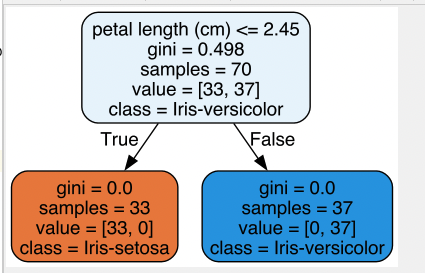

## 一、什么是决策树（Decision Tree）

~~~~
决策树（Decision Tree）是一种基于树结构的分类和回归算法。它通过将数据划分为多个相对简单的部分来建立模型，使得每个部分都分别对应于输入空间的一个小的、局部区域。在分类问题中，决策树算法将样本从根节点开始一步步分类到叶节点，而在回归问题中，决策树算法则会将样本映射到对应的叶节点，并输出该叶节点上所有样本的平均值。
决策树算法的主要优点在于可以处理分类问题和回归问题，并且易于理解和解释。此外，决策树算法不需要任何对数据分布的假设，可以处理具有非线性关系的特征，而且可以处理离散型和连续型的特征。但是，决策树算法也存在一些缺点，比如容易过度拟合、不稳定、对噪声和异常值敏感等。
~~~~

## 二、决策树常用算法
~~~
常用的决策树算法有 ID3、C4.5、CART 、gini系数 等。其中最常用的是 CART 决策树算法，它可以处理二分类和多分类问题，还可以处理连续型和离散型的特征，并且可以输出特征重要性信息。
~~~

## 三、评价指标
~~~
信息增益（Information gain）和熵（Entropy）是决策树中常用的两种评价指标，它们用于衡量数据集的纯度或不确定性，从而选择最佳的属性进行划分。

信息增益指的是在进行某个属性划分前后，数据集的不确定性减少的程度。在决策树算法中，通常使用信息增益来选择最优划分属性。计算方法为信息增益 = 划分前的熵 - 划分后的熵。其中，熵表示数据集的不确定性，熵越大表示数据集的混乱程度越高，不确定性也就越大。

熵值与各个类别的比例有关，一般情况下，当数据集中只包含一种类别时，熵值为0。如果数据集中包含两个类别，且每个类别所占比例相等，熵值为1。而当数据集中包含多个类别时，其熵值则介于0和1之间。因此，熵值可以用作衡量数据集不确定性的指标。计算方法为：熵 = -p1 * log2(p1) - p2 * log2(p2) - ... - pn * log2(pn)，其中 p1, p2, ..., pn 分别表示数据集中每个类别出现的概率。

在决策树算法中，如果某个属性的信息增益最大，则将该属性作为划分属性。使用信息增益作为评价指标往往可以得到较好的分类效果，但是对于可取值数目较多的属性，使用信息增益容易偏向选择取值数目较多的属性。

因此，基于信息增益设计出了一个改进的评价指标，即基于熵的信息增益（Gain Ratio）。基于熵的信息增益会考虑属性自身的熵，从而避免了信息增益偏向于选择取值数目较多的属性的问题。

总之，在决策树算法中，信息增益和熵都是非常重要的指标，它们用于评价不同属性的重要性，并且直接影响决策树的生成和分类效果。
~~~

## 四、其他说明

~~~~
sklearn 中的 DecisionTreeClassifier 是一个决策树分类器，其主要参数包括

criterion：选择属性的衡量标准。默认为 gini，表示使用基尼指数作为衡量标准，也可以设置为 entropy，表示使用信息熵作为衡量标准。

splitter：决定选择哪个特征来作为分裂点的策略。默认为 best，表示选择最佳分割方式；另一个可选项为 random，表示随机选择特征进行分割。

max_depth：决策树的最大深度。默认为 None，表示不限制最大深度。

min_samples_split：划分内部节点所需的最小样本数。默认为 2，即至少有两个样本才会进行划分。

min_samples_leaf：叶节点所需的最小样本数。默认为 1，即每个叶节点至少包含一个样本。

max_features：寻找最佳分割点时考虑的最大特征数。默认为 None，即考虑所有特征。

random_state：随机种子，用于控制随机性。
~~~~

## 五、代码例子说明

~~~~
使用了鸢尾花数据集
dt1:调用sklearn的DecisionTreeClassifier算法，并且画出决策树的整个画
下图是效果图
~~~~
