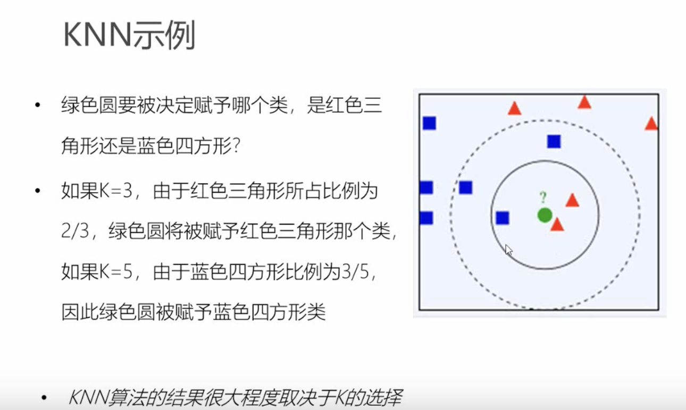
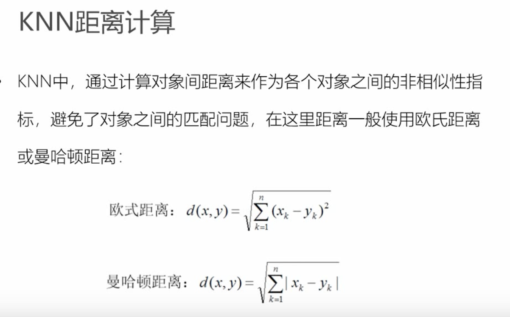

## 一、什么是KNN

~~~~
KNN，即 K-Nearest Neighbors，是一种基本的分类和回归方法。它的主要思想是利用已标记好类别的训练数据集（样本集），对新的输入样本进行分类或回归。
~~~~

## 二、KNN示例

## 三、KNN举例计算

### KNN 算法中最常用的距离度量方法是欧几里得距离和曼哈顿距离
~~~
1、欧氏距离（Euclidean distance）:    也称为 L2 距离或直线距离。它表示两个点之间的距离是它们各个坐标差的平方和的平方根。可以通过以下公式计算两个 n 维向量 X 和 Y 之间的欧几里得距离

2、曼哈顿距离（Manhattan distance）:也称为 L1 距离或城市街区距离。它表示两个点之间的距离是沿着坐标轴的线段长度之和。可以通过以下公式计算两个 n 维向量 X 和 Y 之间的曼哈顿距离 
~~~

## 四、其他说明

~~~~
KNeighborsClassifier 是 sklearn 中的一个分类器 KNeighborsClassifier 的主要参数包括：

n_neighbors：K 值。即在 k-近邻算法中选择的邻居数量，通常需要通过交叉验证确定。

weights：权重函数。默认为 uniform，表示所有邻居权重相等。还可以设置为 distance，表示权重与距离的倒数成反比。

metric：距离度量方法。默认为 minkowski；可以使用其他度量方法，如欧几里得距离（euclidean）、曼哈顿距离（manhattan）等。

algorithm：排序算法。默认为 auto，根据数据的情况自动选择算法，可以设置为 brute、kd_tree 或 ball_tree 进行强制指定。

leaf_size：叶子节点大小。默认为 30，在使用 kd_tree 或 ball_tree 算法时有用。

p：距离度量参数。默认为 2，表示使用 minkowski 距离时的参数，当 metric 为 minkowski 且 p 为其他整数值时，距离公式为 

n_jobs：并行处理数。默认为 1，表示不使用并行化。可以设置为 -1，表示使用全部 CPU 进行并行处理；或者设置为其他数值，表示使用特定数量的 CPU 进行并行处理。
~~~~

## 五、代码例子说明

~~~~
使用了鸢尾花数据集
knn1 :手动写Knn算法
knn1 :调用sklearn的Knn算法
~~~~