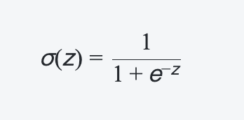
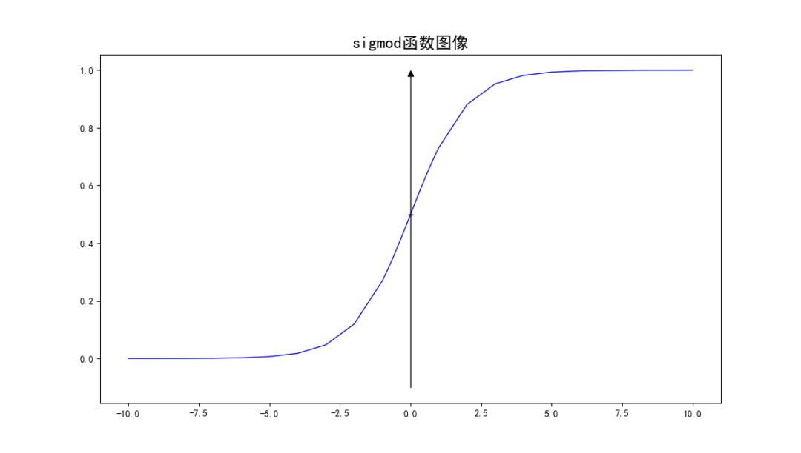

## 一、什么是逻辑回归

~~~~
逻辑回归（Logistic Regression）是一种用于解决分类问题的机器学习算法。它可以被认为是线性回归在分类问题上的推广，主要应用于二分类问题。
逻辑回归的基本思想是将数据拟合到一个特定形式的函数中，该函数称为“Sigmoid 函数”，这个函数可以将数据转换成一个0到1之间的实数，可以被认为是一个概率值。
因此，逻辑回归可以通过计算数据的概率来预测一个新样本属于哪一个类别。通常，对于一个二分类问题，逻辑回归可以划分为两个类别，例如正类和负类，然后预测一个新样本属于哪一个类别
~~~~

`Sigmoid 函数是一种常用的数学函数，它可以将输入变量转换为一个在 0 到 1 之间的实数，常用于逻辑回归等机器学习算法中。
Sigmoid 函数的公式定义如下：`

## 二、逻辑回归算法

~~~  

逻辑回归算法是一种基本的机器学习算法，常用的逻辑回归算法包括以下几种：

1、普通逻辑回归（Logistic Regression）：这是最基础、最常用的逻辑回归算法，在二分类问题中效果较好，也可通过 one-vs-all 或 softmax 扩展到多分类问题中。

2、L1 正则化逻辑回归（L1-regularized Logistic Regression）：对模型加入 L1 正则化项，可以使得模型更加稀疏，抵抗过拟合，但是仅适用于特征数不多的情况。

3、L2 正则化逻辑回归（L2-regularized Logistic Regression）：对模型加入 L2 正则化项，可以抵抗过拟合，在特征数较多的情况下表现较好。

4、Elastic Net（Elastic Net Regression）：是 L1 正则化和 L2 正则化的组合，它可以在具有大量特征的情况下有效地选择特征，同时维护模型的稳定性。
~~~

## 三、逻辑回归损失函数计算方式

~~~~

1、平均绝对误差（Mean Absolute Error, MAE）：MAE是另一种评估预测值与真实值之间差距的指标，它计算的是预测值与真实值之差的绝对值的平均值。MAE相比MSE更加偏向于对异常值不敏感。

2、Huber损失函数（Huber Loss）：Huber损失函数是一种介于MSE和MAE之间的损失函数，它对误差的大小进行了阈值化处理。当误差小于等于阈值时，用MSE，否则用MAE作为损失函数。

3、对数损失函数（Logarithmic Loss）：对数损失函数也称为交叉熵损失函数，它在分类问题中较常见，但在线性回归中也有应用。对数损失函数将预测值和真实值之间的差异进行了对数化处理，可以更好地处理极端情况和异常值。

4、交叉熵损失函数（Cross-Entropy Loss）：是用于衡量两个概率分布之间差异的一种度量方式，它在分类问题中广泛使用

~~~~

## 四、使用领域

~~~~
逻辑回归算法被广泛应用于许多领域，例如医疗保险、市场营销、金融风险评估等。
~~~~

## 五、代码例子说明

~~~~
使用了鸢尾花数据集
logr1 :手动写的逻辑回归模型 使用了梯度下降法来最小化逻辑回归模型的损失函数
logr2 :sklearn逻辑回归模型

~~~~