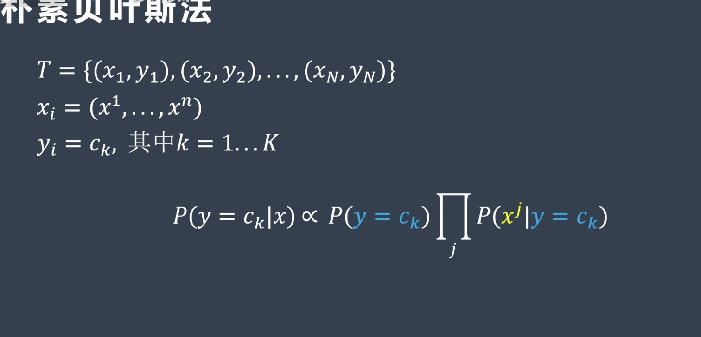

## 一、什么是朴素贝叶斯（Naive Bayes)

~~~~
朴素贝叶斯（Naive Bayes）是一种基于贝叶斯定理的机器学习算法。它的特点在于，假设特征之间相互独立，因此被称为“朴素”贝叶斯。朴素贝叶斯广泛应用于文本分类、垃圾邮件过滤、情感分析等领域。
~~~~

## 二、贝叶斯定理
~~~~
贝叶斯定理表示如下：

P(A|B) = P(B|A) * P(A) / P(B)

其中，P(A|B) 表示在已知 B 发生的情况下，A 发生的概率；P(B|A) 表示在已知 A 发生的情况下，B 发生的概率；P(A) 表示 A 发生的概率；P(B) 表示 B 发生的概率。

对于一个待分类的样本，朴素贝叶斯算法计算其属于某个类别的条件概率，然后选择概率最大的类别作为该样本的分类结果。具体而言，朴素贝叶斯通过以下公式计算条件概率：
P(c|X) = P(c) * P(x1|c) * P(x2|c) * ... * P(xn|c)
其中，P(c|X) 表示类别 c 在给定特征 X 下的条件概率，P(xk|c) 表示在类别 c 成立的情况下，特征 xk 出现的概率。
数学公式如下
~~~~

## 三、朴素贝叶斯分类器的步骤

~~~
计算先验概率：根据样本数据计算每个类别的先验概率，即 P(Ci)。

计算似然概率：根据样本数据计算每个类别下每个特征的条件概率 P(xi|Ci)。

根据贝叶斯定理计算后验概率：利用先验概率和似然概率计算后验概率 P(Ci|X)，即给定输入 X，计算其属于每个类别的后验概率，选择概率最大的类别作为预测结果。
~~~

## 四、其他说明

~~~~
在 Scikit-learn（sklearn）中，GaussianNB（高斯朴素贝叶斯）分类器的主要参数有以下几个：

priors：先验概率，默认为 None。如果指定了先验概率，则模型会使用给定的先验概率进行训练和预测；否则，模型会根据样本数据计算先验概率。

var_smoothing：方差平滑因子，默认为 1e-9。当某个特征的方差为 0 时，模型无法计算该特征在给定类别下的条件概率，从而导致预测失败。为了避免这种情况的发生，可以通过方差平滑来使所有特征的方差都不为 0。

fit_prior：是否学习类别的先验概率，默认为 True。如果设置为 False，则使用统一先验概率（即每个类别的先验概率相等）进行训练和预测。

需要注意的是，除了 GaussianNB 外，Scikit-learn 还提供了多项式朴素贝叶斯（MultinomialNB）和伯努利朴素贝叶斯（BernoulliNB）两种不同类型的朴素贝叶斯分类器，在参数和应用方面存在差异。因此，在选择朴素贝叶斯分类器时需要根据具体情况选择合适的模型，并根据数据的特点选择合适的参数。
~~~~

## 五、代码例子说明

~~~~
使用了鸢尾花数据集
gnd :调用sklearn的GaussianNB算法

~~~~